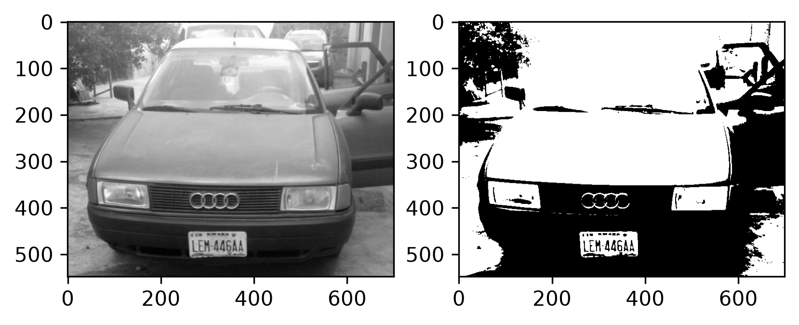
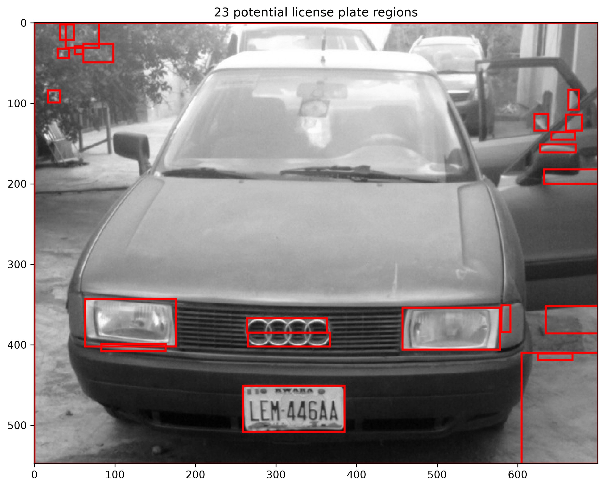

LPR/ALPR has 3 major stages:

1.Detections of the license plate.

2.Segmentation of characters

3.Character recognition

With the use of the package sickit-image, i am able to process images of licence plates on cars, dependencies include:

- scipy (handles my more complex calculations)

- numpy (for multi-dimensional array manipulation)

- matplotlib (for plotting graphs and displaying images)

- Pillow (python imaging library)

After running localization.py

we get the output:

After this, we process the image using cca.py.

We identify all the connected regions using connected component analysis (CCA), which is an algorithmic application of graph theory, where subsets of connected components are uniquely labeled based on a given heuristic.

A pixel is considered to be connected to another if they both have the same value and are djacent.

After running the image through cca.py we get the result:

We can see from the image that regions that do not contain the license plate are also included. So we will eliminate them by using characteristics of a typical license plate, such as:

- The width is more than the heigh(rectangle)

- Proportion of the width of the license plate region to the full image is between 15% and 40%

- The proportions of the height of the license plate region to the full image is 8% and 20%

